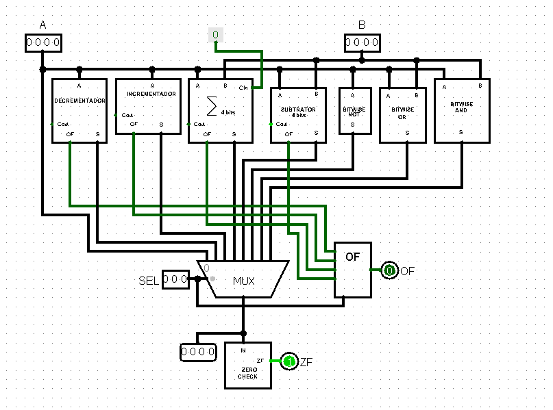

# Trabalhos Circuitos Digitais

Este repositório contém os trabalhos desenvolvidos durante a matéria de circuitos digitais, que envolveram:\
M1 - Display de um dado de 6 lados\
M2 - Criação de uma ULA (Unidade Logica Aritmética)\
M3 - Circuito de contagem sequencial circular